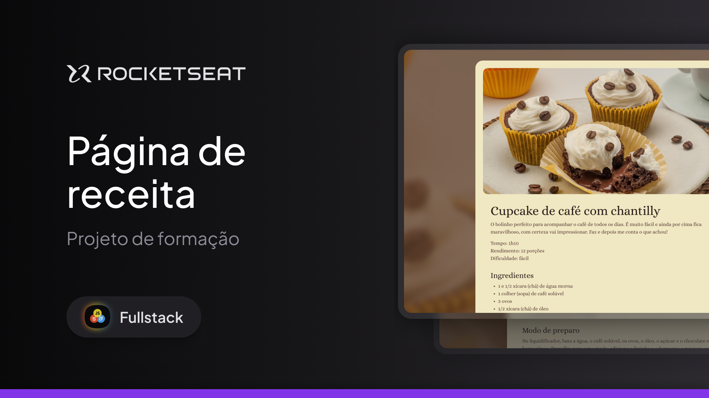

Projeto - Página de Receita pela ROCKETSEAT!  

Olá! Bem-vindo ao projeto de Página de Receitas. Que bom ter você por aqui. Este projeto é uma página web com uma receita de cupcake de café com chantilly.

Sobre o projeto:
Essa página de receita foi projetada para oferecer uma apresentação estilosa e funcional.
Esse projeto é um estudo desenvolvido durante o curso "Full-Stack" da plataforma da RocketSeat.

Tecnologias utilizadas:
<ul>
<li>HTML5</li>
<li>CSS</li>
<li>Figma</li>
<li>Git</li>
<li>GitHub</li>
</ul>

Clone o repositório:

git clone https://github.com/StephCruz97/Projeto-PaginadeReceita.git

Uso
Para usar a Página de Receita, simplesmente abra o arquivo index.html no seu navegador e aproveite as funcionalidades.

Licença
Este projeto está licenciado sob a Licença MIT.